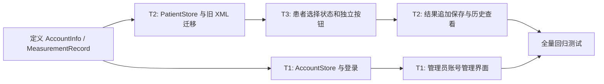

# 本周功能代码实施方案

## 范围与约束

本方案只覆盖：本地账号管理（T1）、同一患者多次检测历史（T2）、患者选择和开始检测分离（T3）。不修改 `src/signalprocessor.cpp`、`src/bonehealth.cpp`、`src/utils.cpp` 中的算法，不改变 SOS 计算、质量门限、稳定性判断、串口协议和采集时序。

当前项目是 Qt 6 / qmake 工程，主要流程仍集中在 `MainWindow`。方案会保持现有页面栈和 XML 存储方式，避免引入数据库。

## 当前实现与根因

### T1：本地账号管理

**现状**

- 登录页为 `ui/mainwindow.ui` 的 `pageLogin`，控件为 `editUsername`、`editPassword`、`btnLogin`、`lblLoginMsg`。
- `src/mainwindow.cpp` 的 `MainWindow::on_btnLogin_clicked()` 直接判断 `user == "1" && pass == "1"`，登录成功后仅切至 `pageMain`。
- `MainWindow` 没有当前登录用户、角色、账号文件、密码校验或账号管理入口。

**根因**

账号既未建模也未持久化，权限不存在；密码是业务代码中的明文常量，重启后无法保留新增账号。

### T2：同一患者保存多次检测记录

**现状**

- `include/types.h` 的 `PatientInfo` 同时包含基本资料（`id/name/gender/birthDay/height/weight`）和结果字段（`checkDate/diagprompt/speedOfSound`）。
- `src/mainwindow.cpp` 的 `loadPatients()` / `savePatients()` 将所有信息读写到应用目录的 `patients.xml`，每个 `<patient>` 是一条混合记录。
- `finishAllPatientRounds()` 计算完成后只更新内存中的 `currentPatient.checkDate`、`speedOfSound`、`diagprompt` 和右侧结果面板；不会自动产生独立历史记录。
- 顶部“保存”按钮对应 `on_btnSaveResult_clicked()`：按 `currentPatient.id` 查找，找到即用 `patientList[i] = currentPatient` 覆盖旧数据；未找到才追加。因此同一 ID 的第二次保存会覆盖第一次。
- 档案表 `refreshTable()` 展示 `patientList`；搜索、双击定位、批量删除和详情编辑均基于“患者即一次记录”的假设。`on_table_cellDoubleClicked()` 以 `id + checkDate` 再回退到 `id` 定位，重复日期或重复 ID 时仍可能选错行。

**根因**

数据模型没有“患者”和“检测记录”的一对多关系；保存路径以患者 ID 为唯一键覆盖。归档页也把患者档案与检测结果当成同一个可编辑、可删除对象。

### T3：建档/更换患者与开始检测分离

**现状**

- 主界面右侧只有 `btnPatientInfo`，UI 文案和代码均把它作为“开始检测/停止检测”。
- `on_btnPatientInfo_clicked()` 同时承担：停止检测、未选患者时跳转 `pagePatientSelect`、已选患者时开始正式检测。
- `startPatientMeasurement()` 在未选患者时也会跳转 `pagePatientSelect`。这使开始按钮兼具“建档/选择患者”和“检测”的职责。
- `on_btnPatientNewSave_clicked()` 创建临时 `currentPatient`、调用 `resetAllPatientMeasurementData()` 并回主界面；它不把基础档案写入 `patientList`。当前只有结果保存时才可能把患者写入 XML。
- 从档案导入患者时，`on_table_cellDoubleClicked()` 的 `ImportMode` 分支会赋值 `currentPatient`、清空测量临时数据、回主界面；现有注释已明确“不自动开始检测”。
- 虽已有 `patientMeasureRunning`、`hasCurrentPatient()`、`resetAllPatientMeasurementData()` 等基础，但没有统一更新按钮文字/可用状态的函数，也没有检测中禁止更换患者的 UI 约束。

**根因**

一个控件承担两种用户动作，且患者档案的持久化时机不明确；患者切换、检测状态和按钮状态没有单一状态更新入口。

## 涉及文件、类、函数和控件

| 位置 | 当前内容 | 实施时的最小改动 |
| --- | --- | --- |
| `include/types.h` | `PatientInfo` 混合患者与结果 | 保留 `PatientInfo` 作为基本档案；新增 `MeasurementRecord`、`AccountInfo`（或将账号结构放入账号存储头文件）。 |
| `include/mainwindow.h` | 账号、档案、检测状态均在 `MainWindow` | 增加账号/历史存储成员、当前登录账号、当前待保存结果，以及患者选择 UI 状态辅助函数和历史查看槽函数。 |
| `src/mainwindow.cpp` | 登录、XML、患者选择、测量完成、保存结果、档案 CRUD | 将对应流程改为调用新增存储类；不改信号处理调用链。 |
| `ui/mainwindow.ui` | 登录页、主页、患者选择页、档案页 | 增加账号管理入口、独立的“建立档案/更换患者”和“开始检测”控件、历史查看入口/对话框入口。 |
| `BoneDensity.pro` | 当前源文件列表 | 加入新增 `.cpp/.h` 和可选的账号/历史对话框 UI。 |
| `patients.xml`（运行时） | 混合历史格式 | 迁移后仅保留患者基本资料。 |
| `measurements.xml`（新增运行时） | 不存在 | 保存检测记录，一名患者可对应多条。 |
| `accounts.xml`（新增运行时） | 不存在 | 保存本地账号、角色、启用状态、密码盐和哈希。 |

现有关键 UI 控件：

- 登录：`pageLogin`、`editUsername`、`editPassword`、`btnLogin`、`lblLoginMsg`。
- 主界面：`pageMain`、`btnPatientInfo`、`btnSaveResult`、右侧患者标签 `labelName/labelID/labelGender/labelBirth/labelHeight/labelWeight`、结果区 `lblLatest*`、进度和状态控件 `barMeasureProgress/lblProcessStatus/barPairA/barPairB/lblPairAValue/lblPairBValue`。
- 患者选择：`pagePatientSelect`、`eName/eID/eGender/eBirth/eHeight/eWeight`、`btnPatientNewSave`、`btnImportFromDB`、`btnBackToMain`。
- 档案：`pageArchive`、`table`、`btnAdd`、`btnDeleteSelected`、搜索控件和 `btnBackFromArchive`。
- 详情：`pagePatientDetail`、`btnDetailSave`、`btnDetailDelete`。

## 建议新增的数据结构与运行时文件

### 1. `AccountInfo` 与 `accounts.xml`

建议新建轻量账号存储类：`include/accountstore.h`、`src/accountstore.cpp`。它只处理 XML 读写、密码哈希与账号规则，不接触 UI 或测量逻辑。

```cpp
struct AccountInfo {
    QString username;
    QString role;          // "admin" 或 "user"
    bool enabled = true;
    QByteArray saltBase64;
    QByteArray passwordHashBase64;
};
```

建议 XML：

```xml
<accounts version="1">
  <account username="admin" role="admin" enabled="true"
           salt="..." passwordHash="..."/>
</accounts>
```

密码规则：每个账号生成随机盐，存储 `SHA-256(salt + UTF-8(password))` 的 Base64；验证时按同一规则比较。该方式满足“不明文”和基础防误用，不宣称替代专业认证系统。禁止创建第二个管理员、禁止停用/删除唯一管理员、禁止普通账号管理账号。

首次启动若 `accounts.xml` 不存在，创建 `admin`。默认密码需要在实施前确定，见文末待确认事项。

### 2. `MeasurementRecord` 与 `measurements.xml`

建议新建 `MeasurementRecord`，结果字段应包含本项目已经计算出的全部临床展示值，避免今后重新按算法推导历史结果。

```cpp
struct MeasurementRecord {
    QString recordId;       // QUuid，不以日期或患者 ID 作为唯一键
    QString patientId;
    QString measuredAt;     // ISO 8601：yyyy-MM-ddThh:mm:ss
    QString operatorName;
    QString part;           // 当前固定为“桡骨”
    double sos;
    double tScore;
    double zScore;
    QString strength;
    double fractureRisk;
    int boneAge;
};
```

建议新建 `include/patientstore.h`、`src/patientstore.cpp`，集中处理患者档案、检测记录、旧 XML 迁移和按患者查询。它不包含 `MainWindow`、串口或算法代码。

```xml
<measurements version="1">
  <measurement id="{uuid}" patientId="P001"
               measuredAt="2026-07-10T14:32:10" operator="admin"
               part="桡骨" sos="4150.2" tScore="0.11" zScore="0.03"
               strength="正常" fractureRisk="..." boneAge="..."/>
</measurements>
```

`patients.xml` 迁移后的新格式保持根节点和 `<patient>` 元素，字段只保留：`id/name/gender/birth/height/weight`。这使患者档案与记录在物理文件和数据模型上分离。

## 每项任务的最小实施方案

### T1：本地账号管理

1. 新增 `AccountStore`，提供 `loadOrInitialize()`、`authenticate(username, password)`、`createUser()`、`setEnabled()`、`resetPassword()`、`deleteUser()`、`save()`；所有变更写入应用程序目录的 `accounts.xml`。
2. 修改 `MainWindow::on_btnLogin_clicked()`：改为调用 `AccountStore::authenticate()`；保存当前登录用户名和角色，清空密码输入框；停用账号返回与密码错误一致的通用提示，避免泄露账号状态。
3. 在 `MainWindow` 新增 `currentAccount`（或用户名和 `isAdmin`）成员；登录后根据角色控制账号管理入口。
4. 新增一个小型 `AccountManagementDialog`（建议独立 `include/src/ui` 文件）：管理员可查看普通账号列表、创建、停用/启用、重置密码、删除。普通账号没有入口；即使通过代码触发，也由槽函数再次校验 `isAdmin`。
5. 在 `pageMain` 顶部增加 `btnAccountManage`，仅管理员登录后可见/可用。账号管理对话框不涉及患者、记录、串口或检测状态。
6. 创建/重置密码只在输入框中接收一次新密码，保存哈希后立即清空；账号名去空格、非空、唯一，并限制为基础安全字符集或给出明确校验提示。

### T2：同一患者多次检测记录

1. 将 `PatientInfo` 的基本字段作为患者档案；去除测量流程对 `currentPatient.checkDate/diagprompt/speedOfSound` 的依赖。为降低一次性改动，可暂时保留这三个旧成员以兼容旧 UI/编译，但新保存与新展示不得以它们作为历史数据源。
2. 新增 `PatientStore` 负责：加载/保存患者、加载/追加记录、按 `patientId` 查询记录、统计记录数、旧 XML 迁移。`MainWindow::loadPatients()` / `savePatients()` 可先改为薄包装，或由它们直接委托该类，避免波及不相关页面。
3. 修改 `finishAllPatientRounds()`：保留当前 T/Z、骨强度、风险、骨龄的既有计算；计算结束后组装一个 `MeasurementRecord`。记录保存时使用 `recordId` 追加，绝不按 `patientId` 覆盖。
4. 修改 `on_btnSaveResult_clicked()`：从“按 ID 覆盖 `patientList`”改为仅保存当前完成检测对应的待保存记录。保存成功后清除待保存标识并禁用/更新保存按钮，防止同一份结果被重复追加。
5. 增加 `showPatientHistory(patientId)`：显示该患者姓名、ID 和按 `measuredAt` 倒序排列的记录表。建议使用只读 `QDialog + QTableWidget`，列至少包括检测时间、SOS、T 值、Z 值、骨强度、风险、骨龄、操作员。历史记录不提供编辑、删除按钮。
6. 在主界面患者区增加“检测历史”按钮；只有选中患者时可用。档案详情页可复用同一历史对话框，避免新建复杂页面。
7. 档案表改为“每个患者一行”，最后检测时间/SOS 可由该患者最新一条历史记录派生显示；患者详情编辑仅编辑基本资料。
8. 修改 `on_btnDeleteSelected_clicked()` 和 `on_btnDetailDelete_clicked()`：若患者存在任何历史记录，则拒绝删除并说明需保留历史；不为 `MeasurementRecord` 提供删除路径。这满足“已保存的历史检测记录不能被删除”。

**保存时机建议**：为满足“每次检测形成独立记录”，建议在 `finishAllPatientRounds()` 生成完整结果后自动追加一次记录；顶部 `btnSaveResult` 改为“保存本次结果”的显式确认入口会造成“检测完成但忘记保存”的漏洞。若保留人工确认，则必须用 `pendingMeasurement` 阻止患者切换/软件退出时静默丢失，且验收要明确覆盖未保存结果。该选择需要确认。

### T3：患者选择与开始检测分离

1. 在 `pageMain` 的患者信息区域保留 `btnPatientInfo`，将它的职责和文案改为“建立档案”或“更换患者”；新增 `btnStartMeasurement`，专职“开始检测/停止检测”。不要复用“获取波形”或 `triggerButton`。
2. 新增 `MainWindow::updatePatientSelectionUi()`，在构造完成、登录后、建档/导入/更换患者后、开始/停止检测后、检测结束后统一调用。规则如下：

| 状态 | `btnPatientInfo` | `btnStartMeasurement` |
| --- | --- | --- |
| 未选择患者，未检测 | 文案“建立档案”，可用 | 文案“开始检测”，禁用 |
| 已选择患者，未检测 | 文案“更换患者”，可用 | 文案“开始检测”，可用 |
| 正在检测 | 文案“更换患者”，禁用 | 文案“停止检测”，可用 |

3. 将当前 `on_btnPatientInfo_clicked()` 中的开始/停止检测逻辑迁移到新增 `on_btnStartMeasurement_clicked()`；`on_btnPatientInfo_clicked()` 仅在未检测时进入 `pagePatientSelect`。`startPatientMeasurement()` 的“未选患者就跳页”保护保留为兜底，但正常 UI 不应触发它。
4. `on_btnPatientNewSave_clicked()` 改为真正建立患者基本档案：校验 ID 唯一，写入 `patients.xml`，设置 `currentPatient`，调用统一的患者切换重置函数，再回主界面；不能开始检测。
5. `on_btnImportFromDB_clicked()` 和 `on_table_cellDoubleClicked()` 的 `ImportMode` 改为通过同一 `selectCurrentPatient(const PatientInfo&)` 辅助函数完成。该函数在 `patientMeasureRunning` 为真时拒绝执行；成功时清空当前未完成测量状态并刷新患者显示和按钮状态。
6. `on_btnBackToMain_clicked()` 从建档页返回时不改变当前患者；新建未确认时不产生患者、不启用开始检测。
7. `startPatientMeasurement()`、`stopPatientMeasurement()`、`finishOnePatientRound()`、`finishAllPatientRounds()` 在改变运行状态后调用 `updatePatientSelectionUi()`，避免文案和可用状态分散修改。

## 更换患者时必须重置的状态清单

更换患者只清理内存中的未完成检测与界面临时状态，不触碰 `measurements.xml` 中已保存历史：

- 采集运行状态：若理论上仍在运行则先执行 `stopPatientMeasurement()`，停止 `autoTimer`，设 `patientMeasureRunning=false`、`autoRunning=false`、`acquireMode=DebugAcquireMode`。
- 当前轮数据：`currentRoundSosList`、`currentRoundAList`、`currentRoundBList`、`currentRoundCorrAList`、`currentRoundCorrBList`、`currentRoundPairMidGapList`、`currentRoundSignedLagDiffList`。
- 本次未完成的多轮数据：`roundSosList`、`roundAList`、`roundBList`、`candidateRoundList`、`processValidCount`、`currentMeasureTargetRounds`。
- 稳定性与质量门控运行态：`recentBoneLagBList`、`boneLagLocked`、`lockedBoneLagCenter`、`boneLagOutOfLockCount`，以及全部 `gate*` 统计与 `lastFrame*` 状态。复用现有 `resetBoneLagStability()` 和 `resetGateStats()`。
- 图表与进度：`seriesSpeed`、`speedPointIndex`、`barMeasureProgress`、`barPairA/barPairB`、`lblPairAValue/lblPairBValue`、`lblProcessStatus`、非模态 `measureTipBox`。
- 本次尚未写盘的结果：`pendingMeasurement`、保存按钮状态、右侧 `lblLatest*`（应显示新患者无本次结果的初始值，或其最新历史记录；此显示规则需确定）。
- 患者显示：调用 `updateCurrentPatientUI()` 后再调用 `updatePatientSelectionUi()`。

现有 `resetAllPatientMeasurementData()` 已覆盖大部分测量数组、进度和趋势图，但未统一处理计时器、所有门控显示状态、待保存记录和按钮状态；实施时应扩展/组合为明确的“患者切换重置”路径，而非在多个槽函数散落清理代码。

## 旧 XML 兼容与迁移

### 现有 `patients.xml` 字段

当前每个 `<patient>` 使用属性：`id`、`name`、`gender`、`birth`、`checkDate`、`part`、`height`、`weight`、`diag`、`sos`。

### 推荐迁移规则

1. 首次发现没有 `measurements.xml` 且旧 `patients.xml` 包含 `checkDate/diag/sos` 时，先复制为 `patients.xml.bak`，再迁移，不能覆盖原文件后才发现转换失败。
2. 以 `id` 合并为一条基本患者档案；姓名、性别、生日、身高、体重不一致时不静默覆盖，应记录到日志并保留第一条，或在首次迁移时提示人工确认。该冲突规则需产品确认。
3. 旧 `<patient>` 若 `sos` 非空，或 `checkDate`/`diag` 表示已有结果，则转为一条 `MeasurementRecord`：`patientId=id`、`measuredAt=checkDate + "T00:00:00"`、`part=旧 part 或“桡骨”`、`sos/strength` 使用旧值；旧格式没有 T/Z、风险、骨龄、操作员时写空值/缺失值，历史 UI 显示 `--`。
4. 旧记录没有全局唯一 ID，同一患者同一天若字段完全一致，迁移应去重；不同 SOS/诊断视为不同历史记录并生成不同 UUID。此去重规则要写入单元/手工测试用例。
5. 成功迁移后，新的 `patients.xml` 只写基本资料，`measurements.xml` 写历史；在根节点加入 `version="2"`，以后按版本读取。旧格式加载失败时不应清空内存或覆盖磁盘文件。
6. 没有旧文件时，创建空的 `<patients version="2"/>` 和 `<measurements version="1"/>`。所有 XML 写入建议使用 `QSaveFile` 原子提交，避免断电留下半个文件。

## 依赖关系与推荐实施顺序



推荐顺序：

1. 先确定数据模型和 XML 迁移（T2 基础），因为 T3 的“建档”必须落到真正的患者档案，且不能再依赖旧的混合 `PatientInfo` 保存语义。
2. 实施 T3 的状态机和 UI 分离，验证选择患者、切换患者和测量不会互相触发。
3. 接入 T2 的测量结果追加和历史只读查看，完成不删除历史的档案约束。
4. 独立实施 T1。账号文件与患者数据无交叉，只在保存检测记录时读取当前操作员姓名。
5. 最后做迁移、权限、历史和测量主流程的组合回归。

## 主要回归风险与防护

- **误改算法/门限**：`finishAllPatientRounds()` 只能在现有计算之后组装记录；不得改 `SignalProcessor`、`MeasureConfig`、门控判断或轮次统计。
- **历史重复写入**：自动保存和 `btnSaveResult` 同时存在时会重复；必须有 `pendingMeasurement.recordId`、已保存标记或只保留一种明确保存时机。
- **历史丢失**：XML 迁移或写入失败不得清空原 `patients.xml`；先备份、校验写入成功后再提交。
- **修改患者 ID 破坏关联**：`on_btnFormSave_clicked()` / `on_btnDetailSave_clicked()` 当前允许改 ID。实施后若该患者已有历史，默认禁止修改 ID；否则必须事务性更新所有 `measurements.xml` 中的 `patientId`，不建议作为本周最小方案。
- **删除患者造成孤儿历史**：有任何记录即禁止删除患者；批量删除与详情删除都必须走同一检查。
- **检测中切换**：除了禁用“更换患者”，槽函数也必须检查 `patientMeasureRunning`，防止快捷键、自动连接或未来调用绕过 UI。
- **重启后未保存结果**：人工保存方案存在丢失风险；自动保存方案要保证 XML 写入失败时不把 UI 标成成功。
- **管理员锁死**：禁止删除/停用最后一个管理员；管理员重置普通用户密码不应要求旧密码。
- **普通账号越权**：账号管理入口隐藏之外，所有管理槽函数还须做角色校验。

## 可执行验收步骤

### T1 验收

1. 删除测试环境的 `accounts.xml` 后启动软件，确认自动生成且能用 `admin` 和已确定的默认密码登录。
2. 管理员创建普通账号，退出并用该账号登录；重启软件后仍可登录。
3. 普通账号看不到账号管理入口；若通过异常路径调用，显示无权限且不改文件。
4. 管理员停用普通账号，确认该账号不能登录；重新启用后可登录。
5. 管理员重置普通账号密码，旧密码失效、新密码生效；检查 XML 中不出现明文密码。
6. 尝试删除或停用唯一管理员，确认被拒绝；删除普通账号后重启，确认不能再登录。

### T2 验收

1. 准备一份当前格式的 `patients.xml`，首次启动后确认生成 `.bak`、新的患者档案和 `measurements.xml`，旧 SOS/诊断可在历史中看到。
2. 为同一患者完成两次完整检测（可跨重启），确认历史有两条不同 `recordId`、不同检测时间，第一次结果未变化。
3. 检查档案页同一患者只显示一行；打开历史可看到两条记录，按时间倒序。
4. 进入患者详情，确认基本资料可编辑；已有历史时删除患者和修改患者 ID 均被阻止。
5. 尝试对历史记录编辑或删除，UI 没有入口且 XML 不被改写。
6. 保存失败（例如目录不可写）的测试环境下，确认显示保存失败、内存中的待保存记录未被误标为已保存，旧 XML 不损坏。

### T3 验收

1. 启动并登录后未选择患者：患者按钮显示“建立档案”，开始检测按钮禁用。
2. 建立新档案后回主界面：患者信息正确显示，患者按钮变为“更换患者”，开始检测按钮启用；不会自动发串口检测命令。
3. 从档案选择另一患者后：不自动检测；上一患者未完成的轮次、进度条、趋势图和临时结果被清空，已保存历史仍在。
4. 开始检测后：更换患者按钮禁用，开始按钮显示“停止检测”；点击后停止采集并恢复“开始检测”。
5. 在一轮或多轮未完成时更换患者，再返回原患者，确认未完成轮次没有被带入，已保存历史不变。
6. 断开设备、手动停止、完成全部轮次等已有流程仍能正确恢复按钮状态；按 USB 热拔插修复的既有测试复测一次。

## 无法从代码判断、需要确认的产品决定

1. `admin` 的默认密码是什么？若不希望代码内有默认密码，是否允许首次启动由现场人员设置管理员密码？
2. 检测完成后采用哪种保存语义：推荐自动追加历史；还是必须由操作员点击“保存本次结果”确认？
3. 账号密码是否需要最小长度/复杂度要求？基础建议为至少 6 位，不强制复杂规则。
4. 普通账号是否允许查看所有患者与历史，还是未来要按操作员隔离？本周建议所有已登录账号均可使用和查看，只有账号管理受限。
5. 患者基本档案是否允许删除？本方案建议“无检测历史可删；有历史则禁止删除”。若医疗流程要求永久保留全部患者，需直接移除删除入口。
6. 已有历史的患者是否允许修改姓名、性别、生日、身高、体重？本方案可允许这些基本信息修改；患者 ID 建议禁止修改以保证记录关联稳定。历史显示应使用保存时快照还是患者最新资料，也需确认。
7. 旧 `patients.xml` 中同一 ID 出现资料冲突时，以哪一条为准，是否需要迁移提示人工处理？
8. 历史记录是否需要允许“作废/备注”而非删除？本周需求未要求，建议不加入。
