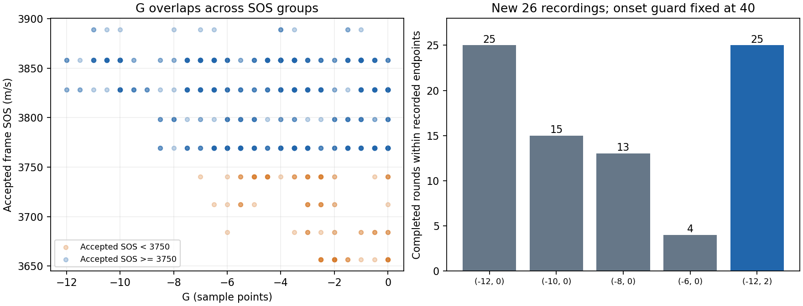

# 2026-09-18：G 范围与首波定位离线比较

> 后续重要修正：用户确认日志混合不同受试者，无法恢复归属，参考值大多3800～3900。文中跨记录结果差异不能视作同一人的重复性，3850不能作为统一真值。门控/同输入回放结论仍有效；最新联合候选和解释见 [joint-validation.md](joint-validation.md)。

> Authority：回顾性工程研究，非参数规范、临床准确性证明或部署授权。产品参数未改动。3850是历史样机参考，不是本批测量的同期真值。

## 结论

- 当前 `G=[-12,0]` 仍是可用基线。下一轮若单独试验 G，优先候选 `[-12,2]`，目的是减少小幅正 G 带来的等待，不是纠正3600～3800的声速差异。
- 不建议直接收紧为 `[-8,0]` 或 `[-6,0]`。最新低于3750的99个计入帧，G全部在[-7,0]；3750以上652帧中，G却覆盖[-12,0]。范围缩窄没有把这两组分开。
- 新数据继续显示局部相关搜索边界对结果有影响，但简单替换首波位置或回溯比例会同时移动原来较高的结果，没有可直接部署的首波改进方案。
- 最大增益1241只作为当前操作基准。需要受控增益/重新放置对照；本研究没有找到最优物理增益。

## 数据与验证

最新实机记录仍为2026-09-15 17:07～17:15，并非9月18日新采集：`build/debug/debug/measurement-experiments/` 下26份、4485帧，implementation为`onset-consistency-20260915-v1`。逐帧从四通道原始码值重建滤波、首波和B/A结果，核对日志首波信息、D/G；被首波检查提前拒绝的帧只核对其实际执行的信息。再复现计数、锁状态、单轮统计、完成序号，原基线全部匹配。

额外复用9月14日40份和9月15日旧35份已验证的原始特征缓存，重新检查原日志SHA-256，并重新验证状态回放。总计101份、22847帧、97个原始单轮摘要。101个输入日志及4个产品源文件运行前后哈希不变。最新5个完整测量的原始五轮平均也与日志精确匹配。

本次是Python独立复现，**不是新增C++/Qt执行验证**；之前首波检查的实际Qt验证证据另见 `docs/evidence/20260915-onset-guard/verification.md`。未运行设备、修改参数、构建或读写临床XML。

## G 候选对比

比较面板在首轮运行前固定为：[-12,0]、[-10,0]、[-8,0]、[-6,0]、[-12,-2]、[-10,-2]、[-8,2]、[-6,2]、[-6,6]、[-12,2]。所有候选固定首波检查40点，保留各文件的其他参数。每份日志在原始停止处结束。

### 最新26份记录

| G范围 | 原始记录结束前完成单轮数 | 相对基线未完成的单轮数 |
|---|---:|---:|
| [-12,0] | 25 | 0 |
| [-10,0] | 15 | 10 |
| [-8,0] | 13 | 12 |
| [-6,0] | 4 | 21 |
| [-12,-2] | 5 | 20 |
| [-8,2] | 15 | 10 |
| [-6,6] | 15 | 10 |
| **[-12,2]** | **25** | **0** |

这里是**单轮**，每5轮才构成一次完整测量。日志往往在刚完成30帧时结束，因此收紧门限后“未完成”不表示真实操作中永远无法完成，只表示已有轨迹长度不足，不得据此给出真实完成率。

图中3750仅作描述分组，不是真伪标签，不参与门控。已计入帧本身已受原G门限筛选，故同时统计了未经过G/稳定性最终接受的基本质量合格帧，见results.json；该群体的G分布更宽，仍没有证明通用最优范围。

`[-12,2]` 相比 `[-12,0]`：

- 25个单轮都保留，没有轮次延后，15轮提前0.932～4.153秒；这是固定轨迹回放时间，不是实测提速承诺。
- 单轮声速最大变化不到8 m/s；两者计入帧范围均未出现小于3000或大于4200的值。3000/4200只是描述性极端值计数，非新准入范围。
- 但放宽并非没有代价：最新计入帧最低值从3656.72降到3629.63。新增的这一帧在`round-20260915-090806-580-0cbf3cff-7d74-468d-a48b-9b2f9b1ebf7f.jsonl`、sequence2209，G=1.5。9月14日统一基线的最低计入值也从3602.94降到3576.64。它没有表现为严重异常或大的整轮漂移，但不能宣传为提高精度或去除低值。
- 保留原来的五轮分组，条件性重算完整结果如下。每组仍是原来的五个录制尝试，不模拟改变反馈后的操作或跨尝试补帧。

| 原完整结果 | 候选条件性五轮平均 |
|---:|---:|
| 3735.714 | 3734.134 |
| 3851.569 | 3851.569 |
| 3850.899 | 3850.899 |
| 3769.320 | 3769.320 |
| 3816.681 | 3816.357 |

因此它主要是操作容忍度候选，**没有缩小五次结果离散，也没有把3736修正成3850**。

### 较早记录的回顾性检查

为了单独比较G，各组统一采用首波40点 + G[-12,0]作为此表基线；它并非较早记录实际使用的G，也不等于当日原始完成数。其他A等配置仍按各文件保持。

| 数据组 | 统一基线单轮 | [-12,2]单轮 | 原有轮次丢失/延后 | 共同轮次最大SOS变化 |
|---|---:|---:|---:|---:|
| 9月14日旧40份 | 7 | 11 | 0 / 0 | 4.72 |
| 9月15日旧35份 | 20 | 25 | 0 / 0 | 6.54 |

这两个较早数据组的原始记录分别形成38和34轮，不能把表中7和20误称为原来实测完成数。所有面板候选在三组回放中均未计入小于3000或大于4200的帧；这不能保证新受试者/新姿态下没有异常。日期拆分也不是独立受试者验证。

## 首波和搜索范围检查

最新计入帧中：

- SOS<3750：99帧，68帧相关最大值位于局部搜索边界；粗延迟102～107点，精延迟131～134点。
- SOS>=3750：652帧，571帧位于边界；粗延迟98～104点，精延迟126～130点。

大量结果依赖粗定位限定的搜索范围；两个组都有此现象，不能直接把边界峰全拒绝。以本批距离0.00784m和采样周期16ns计算，SOS=490000/lag；lag从128变为129，声速约由3828降到3798。因此少数采样点的选点差就足以造成明显变化，但不能据此确定哪一个延迟正确。

对原751个计入帧做B通道敏感性诊断（没有重新验证候选A/D/G和整轮，因此绝不能当作候选最终输出）：

| 诊断替换 | 原<3750组的SOS变化中位数 | 原>=3750组的SOS变化中位数 | 风险 |
|---|---:|---:|---|
| 回溯比例0.20→0.10 | 0 | 0 | 并未系统改善较低组 |
| 回溯比例0.20→0.30 | +55.40 | 0 | 较高组单帧仍可变化-87.67～+119.66 |
| 直接用首次越阈值作为首波 | +28.34 | +30.62 | 两组都上移，较高组最大约3951.61，可能只是引入整体偏移 |

这些结果支持继续研究同一波形地标和搜索边界的耦合，不支持直接换成“让数值变高”的选点方法。此前扩大搜索取全范围最高相关的风险仍然适用。

## 下一批最小对照方案（暂不执行）

后续用户澄清已做过重放测量；当前先使用已有记录，不要求重复采集。以下仅作为将来确有具体验证需求时的备选方案；操作类型/时点必须能对应日志，不能根据波形猜测。最新全流程候选验证见 [candidate-validation.md](candidate-validation.md)。

先保留现有A0.78、G[-12,0]、首波40点，避免同时改变多个因素。增益码不等于dB，实际放大方向尚未核实。

1. **不重新放置、同设置连续测**：在目前习惯的1241下，同一部位尽量不移动，完成3次，保留中断记录。
2. **重新放置重复**：同一设置，探头每次拿开再放回同一部位，完成3次。简单记录顺序即可，程序日志已有逐帧数据。
3. **增益对照另做一组**：尽量维持同一姿势，停止采集后按1241→1180→1241→1100→1241调整控制码，各尝试一次；每次尝试限定约60秒，未完成也保留日志。较低码值只用于辨认硬件响应，不先假定物理增益更低。需要换姿势时记一下。
4. 记录是否同一操作者/部位，以及“连续不移动 / 重新放置 / 改增益”的先后次序，不需要患者身份。若可获得同期参考仪器，在前后各测几次，避免使用历史3850作为真值。
5. 若之后单独试G[-12,2]，保持增益等设置固定；把它作为另一组，不混入上述增益比较。

分析目标：区分固定姿势自身不稳、重新放置偏差、控制码改变波形平段与定位的问题。不要为了凑到3850反复挑位置或删除失败数据。

## 复现和交付边界

运行 `python docs/research/g-range-onset-20260918/analyze.py`。脚本依赖已有numpy/scipy/matplotlib、两个先前验证的特征缓存 `build/wave-audit-20260914/results.json` / `build/wave-audit-20260915/results.json`，以及101份原始日志；不会自动从网络或设备获取数据。机器可读证据 `results.json` 包含全部输入哈希、产品源文件哈希、候选逐轮变化及数据组统计。

当前未改变产品算法、默认参数或运行数据，未提交/推送。`[-12,2]`是下一次单独试测的候选，准确性、跨人泛化、真实提速和最优增益均未验收。
