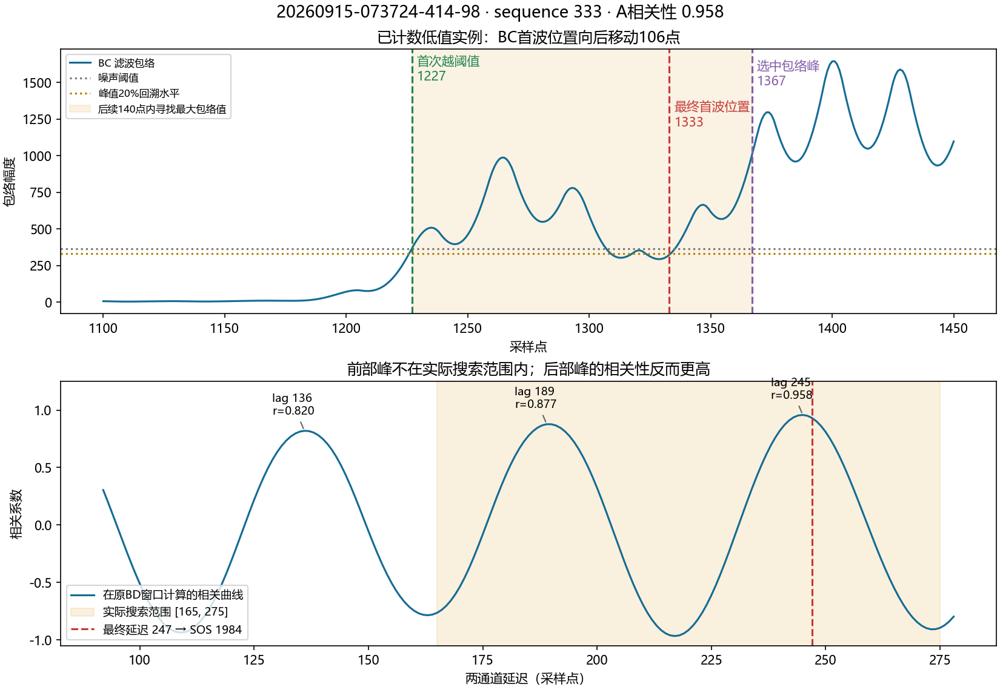
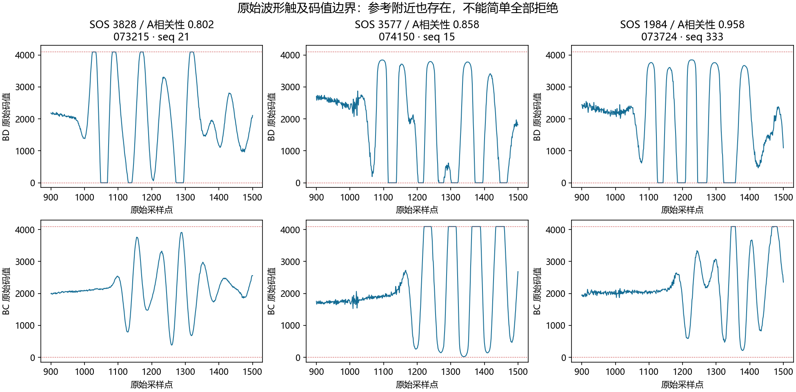

# 2026-09-15 原始波形定位：低值计数与结果离散

> Authority：本文件是回顾性工程研究证据，不是算法、参数或验收规范。没有修改测量代码、门限、采集命令、运行数据或程序。3850是用户提供的历史样机参考，不是同期配对真值。

## 决策结论

1. 已定位到极低值的一条可重现软件路径：BC已检测到前部信号首次越过噪声阈值，但“首波”最终定位在其后86～120点处；由此形成较大粗延迟，搜索范围偏到后部相关峰。高相关性和稳定锁均不能纠正这条路径。
2. 优先研究**首波定位自洽性检查**，出现这种显著后移时拒绝本帧，而不是把SOS筛到3850附近，也不自动把后峰改选成前峰。候选检查在两天记录中有一致的区分效果，尚未部署。
3. 3600附近的稳定结果是独立问题：它们不具有上述首波大幅后移，新增检查不会把这些结果变成3850。原始B波形存在明显码值截断/削顶，值得优先做增益及信号完整性对照；定位算法也明显受粗延迟决定的局部搜索边界影响。不能凭本批数据断言低值全部由削顶造成。
4. 不推荐简单提高A/B相关门限、盲目扩大相关搜索范围、拒绝所有多峰波形、或直接部署更窄的SOS范围。

## 输入、复现与证据边界

输入位于 `build/Desktop_Qt_6_5_3_MinGW_64_bit_Debug/debug/measurement-experiments/`。9月15日35份日志约189.5 MB，9月14日40份日志约216.5 MB；每帧四通道各2000个uint16样本。完整文件名、参数及SHA-256见 [summary.json](summary.json)。未读患者XML、未操作设备。

| 日期 | 文件 | 原始B流程逐帧核对 | A流程核对 | 原计入帧 | 低于3000计入帧 | 形成轮次 / 通过轮次 |
| --- | ---: | ---: | ---: | ---: | ---: | ---: |
| 9月15日 | 35 | 8562 | 7382 | 1126 | 57 | 34 / 30 |
| 9月14日 | 40 | 9800 | 8219 | 1203 | 105 | 38 / 38 |

A流程只在程序实际执行到A的帧核对，包含无效与回退分支。总计18362个B结果、15601个A结果：有效性、实际选点、粗/精延迟、相关性和SOS与日志一致；有A/B结果的D/G也一致。浮点核对容差1e-8，整数选点必须相同。

`analyze.py`独立复现当前源码中的预处理、中位基线、80阶FIR、包络、首次越阈值、峰回溯、局部相关搜索、高相关平台选点及A双窗口评分。`replay.py`另外复现门控、20候选窗口、14预热/10集中、失锁、两点续接保护及30值截尾统计；逐帧接受决定、锁状态、锁中心、计数前数量和全部轮次摘要均与原日志一致。轮次完成对应的帧序号完全一致；摘要日志本身比触发帧晚1～3 ms，不能错误要求二者毫秒值相同。

这不是运行Qt程序的全链路测试，不覆盖串口、GUI、自动续轮调度或存储。候选回放固定已有手部轨迹，并在各原始尝试的记录终点停止；不能推断额外等候后的完成时间、操作反馈改变后的效果、跨人精度或实体故障位置。前一天日志作为额外日期检查，未确认其受试者/介质身份，不称为盲法独立临床验证。

复现（从项目根目录运行，需要numpy/scipy/matplotlib；本机现有Python环境可用）：

```powershell
python docs/research/measurement-wave-audit-20260915/analyze.py
python docs/research/measurement-wave-audit-20260915/replay.py
python docs/research/measurement-wave-audit-20260915/analyze.py 20260914
python docs/research/measurement-wave-audit-20260915/replay.py 20260914
python docs/research/measurement-wave-audit-20260915/summarize.py
```

逐帧派生结果留在 `build/wave-audit-20260915/` 和 `build/wave-audit-20260914/`；本目录仅保留脚本、紧凑汇总和两张图。原始输入哈希前后核对通过。未使用不符项目要求的Qt工具链构建。

## 1. 极低值的定位证据

### 代码行为

`detectFirstArrivalSmart`先找连续8点超过噪声阈值的第一段，记为firstHit；接着在其后140点内取**最大包络值**，并非代码注释所称的“第一个包络峰”。然后从所选峰向前寻找20%水平的穿越点，作为onset。

当前只有“onset不得早于firstHit超过40点”的约束，没有防止onset向后落入另一段波形的对称检查。因而前部信号虽已被检测到，后部较强波仍可能主导定位。这里能确认软件选择跨越了前部信号，不能仅据此判定后部信号的物理传播路径。

### 可直接追溯的实例

文件 `round-20260915-073724-414-98ceb483-2a58-4cce-b3b6-b2e2030750c2.jsonl`，sequence **333**，尝试开始后27.228秒：

- BD：firstHit=1114，onset=1113。
- BC：firstHit=1227，向后140点内选中的包络最大点=1367，回溯onset=1333；相对firstHit后移**106点**。
- 两通道首次越阈值差=113点，最终粗延迟变成220点。
- B实际局部搜索范围=[165,275]。用原BD窗口展开相关曲线，存在lag136/corr0.820、lag189/corr0.877、lag245/corr0.958；前部lag136不在实际搜索范围中。
- 高相关平台最终取lag247，SOS=**1983.81**，B相关性0.932，A相关性**0.958**，D=7，G=-3.5。所有计数门控通过。



这不是“相关性算错了”：后部候选的相似性确实高。A又以B延迟约束搜索，因此不是一份完全独立的延迟正确性证明。

### 两天分布与候选检查

| 已计入帧分组 | BC onset-firstHit |
| --- | --- |
| 9月15日，低于3000的57帧 | 94～120点 |
| 9月14日，低于3000的105帧 | 86～93点 |
| 两天所有其余已计入帧 | 任一B通道向后偏移最大23点 |

研究候选：任一B通道onset比其firstHit晚超过L点时，按早期无效帧处理，进入现有拒绝/过期路径，不送入稳定观察或有效值累计；不修改信号、SOS或A/D/G定义。

测试L=30、40、60、80的回放输出相同。这是数据中的区分间隙，不是普适阈值标定。40只是与现有回溯保护同量级的候选值，不能凭此宣布产品最优参数。

| 日期 | 候选后的效果 | 代价和边界 |
| --- | --- | --- |
| 9月15日 | 57个极低值计数全部消失；34个形成轮次的数值、通过状态、完成帧均不变 | 总计入1126→1067，另少计2帧3684/3712；这2帧原来随后也被换簇清除。不是全帧行为等价 |
| 9月14日 | 105个极低值计数全部消失；原来的2525.77、2515.70、2526.51三轮不再形成 | 其余35个形成轮次的数值、状态、完成帧不变；原有2个未完成尝试仍未形成轮次。被挡住的3轮在已有轨迹长度内没有替代轮次 |

9月15日最新配置的四个完整结果仍为3823.86、3717.34、3605.60、3660.61。新增检查只解决此类异常计入，不改善现有3600结果。9月14日删除轮次后，不推断后续五轮池或最终流程行为；本回放以每次采集尝试为边界。

## 2. 为什么3600与3820仍难区分

最新配置为round A0.78、G[-12,0]，单帧A0.78，B0.55，日志增益码均为1241。不同配置发生在不同实际采集轨迹上，不能把9月15日早些时候的3787/3807直接归因于更优参数。

- 3750～3950的203个已计入帧：粗B延迟99～104，精B延迟127～130。
- 3500～3750的424帧：粗B延迟102～126，精B延迟131～139。另有一个浮点值略低于3500，下面削顶统计归到3000～3750组，总数425。
- 这两组通常没有首波大幅后移。差异主要是小范围的选点/波形变化，不能直接套用极低值的修复。
- 参考附近203帧中185帧的局部相关最大值在搜索边界；3500～3750组424帧中282帧也如此。这说明结果明显依赖粗定位给出的搜索边界；不能简单把“边界峰”全拒绝，否则大量原来可完成的数据会被拒。
- 放开到全范围取最高相关峰会使两组诊断SOS中位数分别落到约2462和2361。**全范围找最高相关不是解决方法。**这只是B候选诊断，没有重新评估A和整轮，不能当作候选完整输出。
- B的回溯比例从0.20改为0.10/0.30、噪声倍率从4改为2/6，对极低值或中等值都不能稳定恢复到参考附近；可能改变到其他延迟。不要把单个例子的改善当作普适修复。

## 3. 新发现：原始码值削顶，值得做受控复测

下图是原始记录值，不是绘图坐标截断：不少波谷连续等于0，部分波峰连续等于4095。确定的是数字样本已经出现边界平段；可能涉及模拟链路、ADC饱和或更早的软件截断，单凭日志不能确定具体环节。



在按FIR群延迟40点回移的141点对齐原始区间中（该区间是诊断窗口，不覆盖FIR的完整卷积支持）：

| 最新配置的已计入帧 | BD触边帧 | BC触边帧 | BC每帧触边点数中位数 |
| --- | ---: | ---: | ---: |
| 低于3000，共57帧 | 39 | 28 | 0 |
| 3000～3750，共425帧 | 425 | 425 | 47 |
| 3750～3950，共203帧 | 203 | 53 | 0 |

这是很强的检查线索，但不同姿势、幅度、窗口和时间段混在一起，不能据相关性宣布因果。参考附近BD也全部触边，因此“有一个0就拒绝”会挡掉整批可用数据。

建议下一轮物理操作验证：同一操作者、部位和尽量不变的探头姿势下，先记录当前增益，再按设备真实增益控制方向逐级减小放大，观察原始波形边界平段是否消失，期间保持测量算法/G/A不变。调整必须在停止采集时进行。增益码到真实模拟增益的关系尚未核实，不能凭码值1241猜一个目标数值或保证数值越小放大越小。之后重新放置重复，最好获得同期参考样机读数。

该试验要回答的是：消除削顶后，首波/相关峰位置和3600～3820的离散是否变化；不是要求操作者调到3850为止。若边界平段不随增益改善，继续检查原始采集/编码链路。

## 建议实施顺序及验收

1. **可单独评审的安全候选**：增加B首波定位自洽性判据及明确拒绝原因；只拒绝明显后移，不改选成参考附近峰。当前证据支持做隔离软件实现与复测，尚不支持直接正式部署。
2. 若获批，先用以上75份原始输入在真实C++/Qt路径验证：原选点/SOS保持不变；异常不计数；记录的非低值轮次不得丢失、延后或漂移；明确确认那2个被额外抑制但原来会被清除的帧；保持瞬断、失锁、续接和自动续轮保护。诊断日志需记录firstHit、onset、峰点和拒绝原因，不能只记录一个低SOS。
3. **操作实验**：核实增益控制方向并降低削顶，保留所有失败/中断记录；通过前后对照区分采集波形问题与选点算法问题。
4. **后续算法研究**：在未削顶或削顶情况已明确的波形上，研究一致的首波/波谷地标与局部相关窗口，再讨论G、轮间一致性或其他参数。没有同期参考和独立新数据前，不拟合3850、不承诺稳定落入某个窄区间。

## 本轮验证与限制

- 75份输入解析、连续序号、完整停止、四通道长度、Base64、SHA-256保持检查通过；原始B/A特征与逐帧状态/整轮统计复现通过。
- 分析脚本初次将“完成帧时间”和稍后写入的摘要时间当成同一时刻，检查报错；查明原日志固定1～3 ms写入间隔后，改为核对准确触发帧序号和日志顺序。未放宽数值或接受判定核对。
- 两张图已渲染并人工查看。没有运行应用构建、校准测试、设备采集、Qt整链路回放或新参数实机试验。
- 所有产品源文件和用户参数保持本轮开始时内容；新增研究文件及更新任务状态，不提交、不推送。
